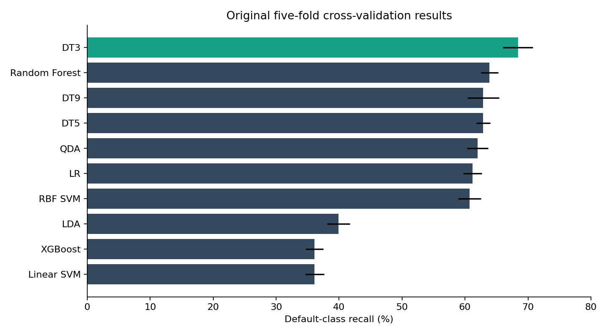
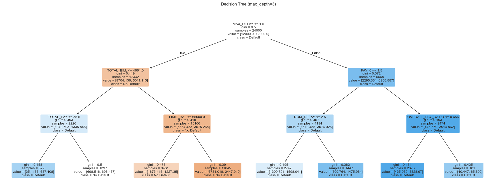

# Credit Card Default Prediction

**Comparing ten classification configurations to identify payment-default risk while keeping model decisions interpretable.**

Academic team project · Python · pandas · scikit-learn · XGBoost

## Overview

Using 30,000 credit-card customer records, we explored repayment behavior, engineered financial and delinquency features, and compared ten classifier configurations. Recall was the primary selection metric because the project focused on identifying actual defaults. Precision and F1 show the cost of flagging customers who do not default.

**Main result:** the depth-3 decision tree achieved **68.4% mean recall in five-fold cross-validation** (standard deviation **2.4 percentage points**). Its separate initial test-split recall was **64.7%**, with **52.8% F1**. These are different evaluations, not interchangeable measures.



## Approach

1. Inspect 30,000 records and the approximately 78% / 22% class imbalance.
2. Remove the customer identifier and encode categorical variables.
3. Engineer utilization, six-month billing/payment totals and delinquency summaries.
4. Create a stratified 80/20 train/test split (random seed 32).
5. Compare logistic regression, three decision-tree depths, random forest, linear and RBF SVM, LDA, QDA and XGBoost.
6. Evaluate five stratified training folds (random seed 42), keeping scaling inside model pipelines.

There are 23 original predictors, plus ID and the target—not 25 predictors. The transformed dataset contains 36 predictors.

## Results and interpretation

| Evaluation | Depth-3 tree result |
|---|---:|
| Training-fold mean recall | 68.4% |
| Fold recall standard deviation | 2.4 percentage points |
| Initial test-split recall | 64.7% |
| Initial test-split F1 | 52.8% |

All ten historical cross-validation results are in [the results table](results/original_cv_results.csv). The comparison chart uses those saved outputs. The depth-3 tree was independently rerun against the project CSV during portfolio preparation; full-precision rerun metrics are in [verified_decision_tree.json](results/verified_decision_tree.json). The entire ten-model experiment has not been rerun during this preparation.



The original tree splits first on maximum repayment delay. The shallow structure makes its rules inspectable. This is the best recall among the tested configurations, not proof that a shallow tree universally outperforms more complex models.

## Run the analysis

```bash
python -m venv .venv
# macOS / Linux
source .venv/bin/activate
# Windows PowerShell: .venv\Scripts\Activate.ps1
python -m pip install -r requirements.txt
jupyter lab notebooks/credit_card_default.ipynb
```

Run notebook cells in order. See [data access instructions](data/README.md) for the source URL or local CSV option. Profiling is optional and disabled by default because its embedded HTML accounted for much of the original notebook size. SVM training and cross-validation can take substantial time. Dependency versions are unpinned because the original environment was not recorded; exact results can vary across versions.

## Limitations and technical review

- The original workflow inspected the test split across models before cross-validation. It should not be described as an untouched final test. A stronger extension would reserve a fresh final holdout or use nested cross-validation.
- The original XGBoost run warned that `class_weight` was ignored. The portfolio notebook removes that ineffective argument; the historical comparison does not represent a class-balanced XGBoost model.
- Recall prioritization is a project assumption. False-positive costs were not quantified, and no profit improvement was measured.
- Demographic features were included. Fairness, subgroup performance, probability calibration and temporal generalization were not evaluated.
- Collapsing repayment-status codes and clipping utilization can discard information. Summed monthly bills can include balances carried forward; they should not be interpreted as unique debt.
- The report proposed monthly payment-to-bill ratios, but the notebook implemented only the overall ratio. Documentation here follows the actual code.
- This is an educational analysis, not a production lending system.

## Team and my contribution

**Team:** Ethan Vanbeurden, Rahul Malla and Eric Testen.

**Rahul Malla:** Contributed across coding, exploratory analysis, data cleaning, feature engineering, model development, evaluation and report writing, in collaboration with teammates. Results are team achievements.

## Provenance

Developed for DTSC 2302, Project 2, Part A. The unrelated Challenger case study in Part B is outside this repository’s scope. The source notebook disclosed Claude assistance with troubleshooting, parameter optimization, pipelines, visuals and data-description formatting. ChatGPT assisted with this portfolio packaging, documentation review and targeted decision-tree verification. No new ten-model performance claims were generated during packaging.

The portfolio edition removes large embedded outputs and machine-specific paths, makes profiling optional and clarifies methodological claims. Original model settings are retained except for removing the ignored XGBoost argument. No blanket license is asserted over collaborators’ work or third-party data.
